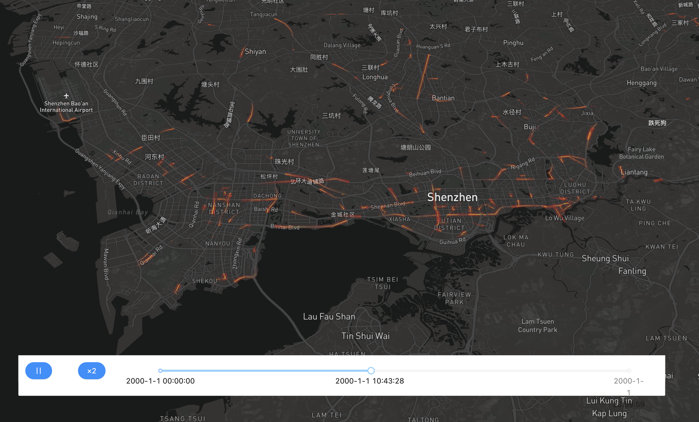

# 轨迹可视化系统 

动态可视化轨迹数据，点击这个[链接](https://ni1o1.github.io/TrajView/build/)即可访问

## 样例数据

Demo数据存放在[这里](https://github.com/ni1o1/TrajView/tree/main/demodata)，将demo数据下载后导入即可

## 主要功能

- 导入带有ID，时间，经纬度信息的GPS数据并进行轨迹动态可视化

## 用什么做的？

编程语言：JavaScript
主要用到的有下面这些包:

- 前端框架：[React.js](http://reactjs.org)
- 组件通信：[PubSubJS](https://github.com/mroderick/PubSubJS)、[redux](www.redux.org.cn/)
- UI框架：[AntD](https://ant.design/)
- 地图底图：[React-map-gl](http://visgl.github.io/react-map-gl/docs)
- 地图可视化：[Deck.gl](http://deck.gl)
